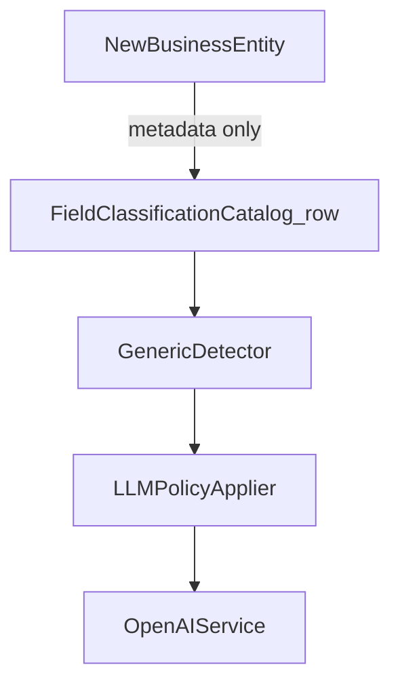

# Implementation Design — Business Information Protection

**Version:** 1.0  
**Status:** Frozen baseline (awaiting team review/approval before Phase 6 Java)  
**Scope:** Design only — no runtime changes until Phase 6  
**Related:** [01-global-information-classification.md](01-global-information-classification.md), [02-business-data-protection-policy.md](02-business-data-protection-policy.md), [03-business-information-detection-spec.md](03-business-information-detection-spec.md), [04-decision-log.md](04-decision-log.md)

---

## 1. Purpose

Define **how** the V1.0 governance layer integrates into the existing Spring Boot application so Phase 6 is disciplined implementation against an agreed blueprint—not redesign-while-coding.

Traceability:

```text
Governance (docs 01–04)
  → Implementation Design (this document)
  → Phase 6 Java
```

---

## 2. Architectural invariants

1. **Primary enforcement point** is `OpenAIService` (LLM egress). Live/Lex/M3 bypass.
2. **Protection policies are evaluated at runtime based on `ProtectionContext`, but the underlying information classification remains unchanged.** Classification is stable and global; policy application is context-dependent.
3. Catalog lookup returns `Optional<FieldClassification>` only; never invents Unclassified rows. Absent → ProtectionService temporary Unclassified → **BLOCK**.
4. Detector returns spans (offsets, code, detection confidence) only — no category or placeholder.
5. PolicyApplier does not query the catalog; it receives span + classification + text.
6. **Metadata-driven detection:** The `BusinessInformationDetector` must be metadata-driven. Business entity knowledge shall reside in catalogs/configuration rather than hard-coded detection rules wherever practical. Adding a new business entity should normally require updating metadata, not detector logic.
7. **Logical separation, V1 co-location:** Classification/policy metadata and detection metadata are logically separate concerns. For V1 they may live on the same catalog row. They may be split later without changing the protection pipeline (see Future Evolution).

---

## 2.1 Maintainability model (locked)

**Rejected:** detector with hard-coded `if (text.contains("customer"))` (or similar) that grows per new M3 concept.

**Required (V1):**

```text
Detector (generic engine)
  → loads detection fields from FieldClassificationCatalog rows
       (keywords, aliases, optional value-shape hints per code)
  → matches utterance against that metadata
  → returns DetectedSpan{code, start, end, confidence}
  → classification/policy fields from the same catalog (Optional lookup)
  → LLMPolicyApplier
```

**V1 catalog choice:** Single `FieldClassificationCatalog` co-locating classification + detection metadata (Option A). Upgrade path to split catalogs is documented under Future Evolution.

**Adding a new entity (normal path):**

1. Add/update one catalog row (classification + detection keywords).
2. Add catalog tests.
3. No changes to Detector, PolicyApplier, PlaceholderFormatter, or OpenAIService.

**Only when a genuinely new matching strategy appears** (e.g. a new value-shape family) may detector *engine* code change—and that is an engine extension, not a per-entity branch.

**Reuse of existing business catalogs:** Detector may read `SearchFieldCatalog` / `InformationRequestCatalog` keywords as a seed or secondary source. The **system of record for protection detection metadata** is the protection catalog row.



---

## 3. Step 1 — Integration point (locked)

```text
Primary enforcement point: OpenAIService (LLM egress)

Live / Lex / M3:          Bypass
LLM-bound paths:          Apply Business Information Classification + LLM Exposure Policy
ComprehendChatService:    Orchestrator only (routing) — no protection logic
```

Do not reopen unless how the application reaches the LLM fundamentally changes.

---

## 4. Step 2 — Components (locked)

```text
OpenAIService
      │
      ▼
BusinessInformationProtectionService   (facade)
      │
      ├── BusinessInformationDetector      (generic, metadata-driven)
      ├── FieldClassificationCatalog       (Optional lookup; V1 co-located metadata)
      ├── LLMPolicyApplier                 (pure)
      └── PlaceholderFormatter             (stateless)
```

| Component | Responsibility | Inputs | Outputs | Dependencies |
|-----------|----------------|--------|---------|--------------|
| `BusinessInformationProtectionService` | Orchestrate detect → classify → apply | text, `ProtectionContext` | `ProtectedText` | Detector, Catalog, PolicyApplier, Formatter |
| `BusinessInformationDetector` | Generic matcher over catalog detection metadata | text, detection metadata rows | `DetectedSpan[]` | Catalog (detection fields only) |
| `FieldClassificationCatalog` | Code → Optional classification + detection metadata | code | `Optional<FieldClassification>` | Seeded from V1.0 docs (+ keyword seed from existing catalogs at build time) |
| `LLMPolicyApplier` | Apply ALLOW/MASK/REPLACE/BLOCK/REVIEW | text, spans + classifications, context | protected text + actions | PlaceholderFormatter |
| `PlaceholderFormatter` | PlaceholderType → token | type, FormattingConfig | string token | Config only |
| `ProtectionContext` | Purpose and future flags | — | purpose, optional tenant/debug/policyVersion | — |

**Catalog miss:** ProtectionService applies temporary Unclassified → BLOCK (not the catalog).

**REVIEW:** treat as BLOCK until Decision Log promotes the row.

**What stays unchanged:** `ComprehendChatController`, `ComprehendChatService` routing, Lex, `M3RequestBuilder`, SearchFieldCatalog / ApiFieldCatalog / InformationRequestCatalog **behavior**, Comprehend/Presidio personal PII pipeline.

---

## 5. Step 3 — Runtime sequences

### 5.1 Live (bypass)

```text
User → ComprehendChatService → Lex → M3
```

No `BusinessInformationProtectionService`. Lex uses **original** business values.

### 5.2 LLM answer path (`Purpose.ANSWER`)

```text
User → ComprehendChatService → (personal PII sanitize) → RAG / general
  → OpenAIService (chatWithRagContext / chatGapFill / chatWithoutPersistence / chat)
  → prepareUserContentForOpenAi
  → BusinessInformationProtectionService.protect(text, ProtectionContext{ANSWER})
  → buildMessages → callOpenAi
```

V1 protection priority: **user-bound utterance** (and history content sent to the model). RAG **documentation chunks** are not rewritten in V1.

### 5.3 Query rewrite (`Purpose.REWRITE`)

```text
… → OpenAIService.rewriteQueries
  → BusinessInformationProtectionService.protect(text, ProtectionContext{REWRITE})
  → rewrite LLM call
```

### 5.4 REWRITE policy override (explicit exception)

| Purpose | Category | Effective policy |
|---------|----------|------------------|
| ANSWER | BDI | REPLACE (global catalog) |
| REWRITE | BDI | **ALLOW** — retrieval-specific override only |
| REWRITE | OMD | ALLOW |
| REWRITE | PII, SPI, BFI, BCI, TECH, UDF, Unclassified | REPLACE or BLOCK per catalog / fail-closed |

> **This is a retrieval-specific policy override. It does not change the global classification of BDI and must not be reused outside query rewriting without an explicit policy decision and Decision Log entry.**

```mermaid
flowchart TD
  subgraph livePath [Live_Bypass]
    u1[User] --> ccs1[ComprehendChatService]
    ccs1 --> lex[Lex]
    lex --> m3[M3]
  end
  subgraph answerPath [LLM_ANSWER]
    u2[User] --> ccs2[ComprehendChatService]
    ccs2 --> pii[Comprehend_Presidio]
    pii --> oai[OpenAIService]
    oai --> bips[BusinessInformationProtectionService]
    bips --> call[callOpenAi]
  end
  subgraph rewritePath [LLM_REWRITE]
    rw[rewriteQueries] --> bips2[protect_REWRITE]
    bips2 --> rewriteLlm[rewrite_LLM]
  end
```



---

## 6. Step 4 — Data contracts

| Contract | Fields (conceptual) |
|----------|---------------------|
| `ProtectionContext` | purpose (`ANSWER` \| `REWRITE` \| …), optional tenantCode, debug, policyVersion |
| `DetectedSpan` | start, end, code (nullable if shape-only), detectionConfidence |
| `FieldClassification` | code, category, llmExposurePolicy, placeholderType, confidence, protectionReason, **detectionKeywords**, **detectionAliases**, optional valueShapeKey |
| `SpanClassification` | DetectedSpan + Optional FieldClassification |
| `ProtectionAction` | span, policy applied, placeholderType if REPLACE |
| `ProtectedText` | text, List of ProtectionAction |

V1: no required `ChatResponse` schema change. Debug exposure may later follow existing sanitization-debug patterns.

---

## 7. Step 5 — Phase 6 implementation order

Implement against this design. If a genuine limitation appears, **record a Decision Log entry**—do not redesign ad hoc while coding.

1. Seed `FieldClassificationCatalog` from V1.0 markdown (+ detection keyword seed from existing catalogs).
2. `PlaceholderFormatter` + FormattingConfig.
3. Metadata-driven `BusinessInformationDetector` (generic; fixtures first).
4. `LLMPolicyApplier`.
5. `BusinessInformationProtectionService` + `ProtectionContext` (incl. REWRITE override).
6. Integrate `OpenAIService` answer methods with `Purpose.ANSWER`.
7. Integrate `rewriteQueries` with `Purpose.REWRITE`.
8. Tests: policy matrix; Unclassified→BLOCK; Live untouched; REWRITE BDI ALLOW exception; new-entity = catalog-only change.
9. Feature flag `business-information.protection.enabled` default **false**; validate before enabling.

---

## 8. Future Evolution

Detection metadata and classification metadata are currently stored together for implementation simplicity. If future requirements (such as multilingual detection, tenant-specific aliases, or independent governance lifecycles) require it, they can be separated into independent catalogs (`BusinessClassificationCatalog` vs `BusinessDetectionCatalog`) without changing the overall protection pipeline:

```text
BusinessInformationProtectionService
  → Detector (reads detection catalog)
  → Classification lookup (reads classification catalog)
  → LLMPolicyApplier
  → PlaceholderFormatter
  → OpenAIService
```

---

## 9. Non-Goals (V1)

- No changes to Live/Lex/M3 execution flow.
- No database schema changes.
- No changes to existing `SearchFieldCatalog` or `InformationRequestCatalog` **behavior** (read-only keyword seed allowed).
- No multilingual detection support.
- No tenant-specific protection policies.
- No protection of RAG document chunks (user-bound content is the V1 priority).
- No automatic synchronization between protection metadata and business metadata.

---

## 10. After approval

1. Team reviews and approves this document.  
2. Freeze documents.  
3. Begin Phase 6 Java **without changing the architecture** unless a real implementation issue is discovered and logged.

Phase 6 is an engineering exercise against this blueprint—not a redesign phase.
